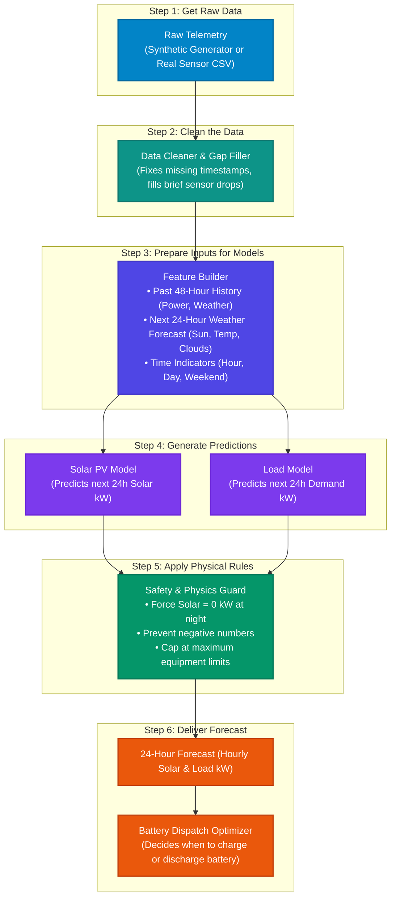

# System Architecture: 24-Hour Solar PV & Load Forecasting Pipeline

This document explains how the 24-hour solar and electricity demand forecasting system works for the microgrid.

---

## 1. High-Level Flowchart (Simplified Overview)

Anyone can understand how data moves through the system in **6 simple steps**:



---

## 2. What Happens at Prediction Time (Step-by-Step)

When the system needs a new 24-hour forecast (for example, at 12:00 PM today), here is the step-by-step conversation:

```mermaid
sequenceDiagram
    autonumber
    actor User as Microgrid Controller
    participant Cleaner as 1. Data Cleaner
    participant Builder as 2. Feature Builder
    participant Models as 3. ML Models (LightGBM)
    participant Safety as 4. Safety Guard

    User->>Cleaner: Send past 48h sensor readings & next 24h weather forecast
    Cleaner->>Cleaner: Check for missing hours & fill small gaps
    Cleaner-->>Builder: Pass clean data

    Builder->>Builder: Combine past trends + future weather for hours 1 to 24
    Builder-->>Models: Pass prepared feature table (24 rows)

    Models->>Models: Predict solar and load for all 24 hours at once (< 15 ms)
    Models-->>Safety: Send raw predictions

    Safety->>Safety: Set solar to 0 kW if sun is down; ensure no negative values
    Safety-->>User: Return clean 24-hour solar & load forecast schedule
```

---

## 3. How the 6 Steps Work (Plain English)

| Step | Component | Plain English Description |
| :---: | :--- | :--- |
| **1** | **Get Raw Data** | Loads historical readings (past power, temperature, sun irradiance) from either our deterministic synthetic generator or real hardware CSV files. |
| **2** | **Clean the Data** | Real sensors sometimes drop data for 1-2 hours. This step automatically aligns everything to hourly intervals and smoothly fills in small gaps so the models never crash. |
| **3** | **Prepare Inputs** | Gathers the ingredients the models need: past history up to right now, plus the forecasted weather (sun, clouds, temperature) and calendar factors (hour of day, weekend) for each of the next 24 hours. |
| **4** | **Generate Predictions** | Two fast LightGBM models (one for Solar, one for Building Load) look at the inputs and generate the initial 24-hour predictions in less than 15 milliseconds. |
| **5** | **Apply Physical Rules** | Machine learning doesn't inherently know physics, so this step enforces common-sense electrical rules: solar **must** be zero at night, and power can never be negative. |
| **6** | **Deliver Forecast** | Packages the clean 24-hour forecast into an easy-to-read format and delivers it to the battery controller so it can intelligently schedule charging and discharging. |

---

## 4. Key Advantages of This Architecture

1. **Simple and Fast**: Runs comfortably on a laptop. Models train in under 5 seconds and predict in under 15 milliseconds.
2. **Reliable**: No compounding errors. Predicting hour 24 does not depend on hour 23's guess.
3. **Resilient**: If sensors drop out for an hour or two, the system heals itself automatically.
4. **Physically Grounded**: Guaranteed zero solar output during nighttime and no negative power values.
