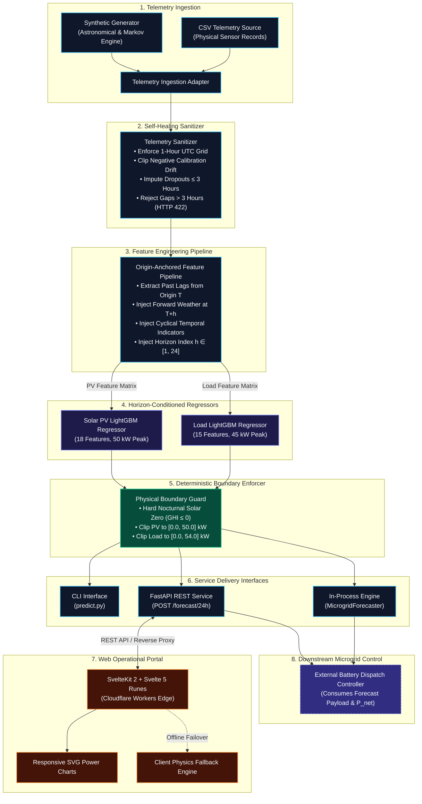
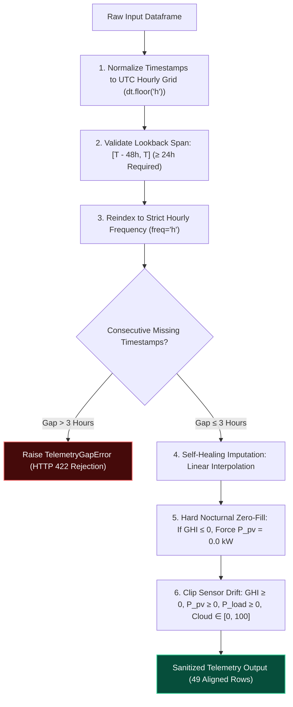
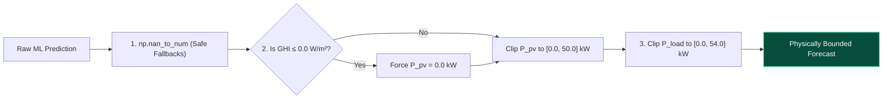
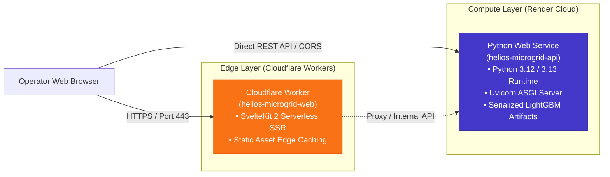
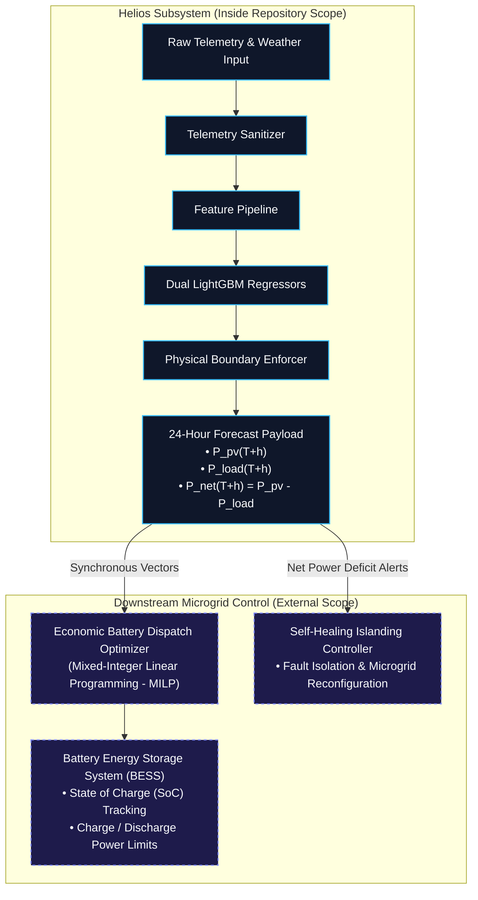

# Helios Microgrid Forecasting Subsystem: Architecture Specification

This document describes the software architecture, data pipelines, machine learning models, and deployment topology of the **Helios** forecasting subsystem.

---

## 1. System Identification and Operational Scope

The **Helios** subsystem provides 24-hour day-ahead solar photovoltaic (PV) power generation and facility electrical load demand forecasts. Helios operates as the supervisory forecasting layer for an AI-assisted self-healing microgrid.

### 1.1 Physical Asset Envelopes

The physical assets determine the normalization baselines and the hard operating boundaries of the microgrid:

| Asset Parameter | Symbol | Nominal Value | Engineering Unit | Architectural Description |
| :--- | :--- | :--- | :--- | :--- |
| **Solar PV Inverter Rating** | $P_{\text{pv\_peak}}$ | `50.0` | Kilowatt (kW) | Maximum electrical power capacity of the solar inverter. |
| **Peak Load Demand** | $P_{\text{load\_peak}}$ | `45.0` | Kilowatt (kW) | Maximum expected facility electrical load demand. |
| **Facility Baseload Demand** | $P_{\text{load\_base}}$ | `10.0` | Kilowatt (kW) | Continuous nominal facility base electrical demand. |
| **Transient Load Peak Limit** | $P_{\text{load\_max}}$ | `54.0` | Kilowatt (kW) | Hard upper ceiling ($1.2 \times P_{\text{load\_peak}}$) for electrical transients. |

### 1.2 Temporal Parameters

The forecasting subsystem operates under fixed temporal parameters:

- **Forecast Origin ($T$)**: The reference timestamp that anchors all observed historical telemetry.
- **Lookback Window**: A continuous 48-hour historical telemetry interval ($[T - 48\text{h}, T]$, 49 hourly samples). The system requires a minimum lookback interval of 24 hours.
- **Forecast Horizon ($h$)**: A discrete sequence of 24 future hourly steps ($h \in [1, 24]$), representing $[T + 1\text{h}, T + 24\text{h}]$.
- **Sampling Interval ($\Delta t$)**: Discrete 1-hour uniform intervals.

---

## 2. High-Level System Architecture

The forecasting subsystem transforms raw sensor telemetry into physically verified 24-hour generation and demand vectors.

### 2.1 Component Flow Diagram



### 2.2 Subsystem Execution Sequence

```mermaid
sequenceDiagram
    autonumber
    actor Client as Operator / Microgrid Controller
    participant API as FastAPI Service (ml_service/api.py)
    participant Sanitizer as Telemetry Sanitizer (sanitizer.py)
    participant Pipeline as Feature Pipeline (pipeline.py)
    participant Models as Dual LightGBM Models (models/)
    participant Guard as Boundary Enforcer (boundary_enforcer.py)

    Client->>API: POST /forecast/24h (History [T-48h, T] + Weather [T+1h, T+24h])
    API->>Sanitizer: Validate & Clean Telemetry Buffer
    alt Consecutive Dropout > 3 Hours
        Sanitizer-->>API: Raise TelemetryGapError
        API-->>Client: HTTP 422 Unprocessable Entity
    else Telemetry Valid or Recoverable
        Sanitizer->>Sanitizer: Linearly interpolate gaps ≤ 3h & zero nocturnal solar
        Sanitizer-->>Pipeline: Return 49 Clean Hourly Telemetry Rows
    end

    Pipeline->>Pipeline: Extract origin lags at T and map forward weather at T+h
    Pipeline-->>Models: Deliver PV Matrix (24x18) and Load Matrix (24x15)

    Models->>Models: Execute vectorized LightGBM regression (< 15 ms)
    Models-->>Guard: Return raw predicted vectors

    Guard->>Guard: Force P_pv = 0.0 when GHI ≤ 0.0; clip P_pv to [0, 50], P_load to [0, 54]
    Guard-->>API: Return safe 24-hour prediction payload
    API-->>Client: HTTP 200 OK (Timestamps, P_pv, P_load, Metadata)
```

---

## 3. Core Architectural Decision: Horizon-Conditioned Regression (ADR 0001)

### 3.1 Design Problem

Multi-step ahead time-series forecasting requires an operational strategy to predict all 24 hours of the forward horizon. Three design options exist:

| Strategy | Architecture Description | Disadvantages | Architectural Verdict |
| :--- | :--- | :--- | :--- |
| **Option A: Recursive Autoregression** | A single step-ahead model ($h=1$) feeds its own output iteratively back into historical lags for steps $h=2 \dots 24$. | Prediction errors compound across steps. Inference requires 24 sequential model evaluations. | **Rejected** |
| **Option B: Direct Multi-Model Ensemble** | 24 separate hourly models for Solar PV and 24 separate hourly models for Load (48 total models). | High artifact storage ($> 50\text{ MB}$), slow retraining ($> 60\text{ s}$), and complex operational version management. | **Rejected** |
| **Option C: Horizon-Conditioned Regressor** | **A single tabular model per target** accepts the relative horizon index $h \in [1, 24]$ as an explicit feature alongside origin-anchored history. | Requires forward weather predictions as input for all horizon steps $T+h$. | **Adopted ([ADR 0001](docs/adr/0001-horizon-conditioned-forecasting.md))** |

### 3.2 Mathematical Formulation

The system trains two independent gradient-boosted tree models ($f_{\text{pv}}$ and $f_{\text{load}}$):

$$\hat{P}_{\text{pv}}(T+h) = f_{\text{pv}}\Big(\mathbf{X}_{\text{pv\_history}}(T), \; \mathbf{X}_{\text{weather}}(T+h), \; \mathbf{X}_{\text{calendar}}(T+h), \; h\Big)$$

$$\hat{P}_{\text{load}}(T+h) = f_{\text{load}}\Big(\mathbf{X}_{\text{load\_history}}(T), \; T_{\text{amb}}(T+h), \; \mathbf{X}_{\text{calendar}}(T+h), \; h\Big)$$

Where:
- $\mathbf{X}_{\text{history}}(T)$ represents historical power and sensor values observed at or before forecast origin $T$.
- $h \in [1, 24]$ represents the forward horizon step index.
- Future predictions at $T+h$ do not feed into subsequent steps, preventing error compounding.

---

## 4. Telemetry Ingestion Subsystem (`ml_service/data/`)

The ingestion layer provides a unified interface for synthetic data and physical sensor logs.

### 4.1 Required Telemetry Schema

All telemetry inputs must conform to the following schema:

| Column Name | Data Type | Physical Range | Engineering Unit | Description |
| :--- | :--- | :--- | :--- | :--- |
| `timestamp` | Datetime / ISO 8601 | Unbounded | UTC | Sampling timestamp. |
| `ghi` | Float | $\ge 0.0$ | $\text{W/m}^2$ | Global Horizontal Irradiance. |
| `temp_amb` | Float | $[-20.0, 55.0]$ | $^\circ\text{C}$ | Ambient dry-bulb temperature. |
| `cloud_cover` | Float | $[0.0, 100.0]$ | $\%$ | Cloud fraction percentage. |
| `p_pv` | Float | $[0.0, 50.0]$ | $\text{kW}$ | Photovoltaic generation active power. |
| `p_load` | Float | $[0.0, 54.0]$ | $\text{kW}$ | Facility electrical load demand. |

### 4.2 Data Sources

1. **`BaseTelemetrySource`**: The abstract base class defining the `.load_telemetry()` contract.
2. **`CSVTelemetrySource`**: Ingests historical data from CSV files and validates schema integrity.
3. **`SyntheticTelemetrySource`**: Generates full-year (8,760 hours) continuous microgrid telemetry:
   - **Astronomical Solar Geometry**: Calculates solar declination ($\delta$), hour angle ($\omega$), and zenith angle ($\theta_z$) at latitude $\phi = 25.0^\circ\text{N}$. Calculates clear-sky irradiance from solar constant $I_0 = 1367.0\text{ W/m}^2$.
   - **Markov Cloud Persistence**: Synthesizes cloud cover using an autoregressive Markov persistence model ($\rho = 0.88$) and beta-distributed random noise.
   - **Harmonic Temperature**: Generates annual and diurnal thermal cycles with a 3-hour thermal phase lag peaking at 15:00 local time.
   - **Photovoltaic Cell Derating**: Applies a standard negative thermal power temperature coefficient:
     $$P_{\text{pv}} = P_{\text{pv\_rated}} \times \left(\frac{GHI}{1000}\right) \times \Big(1 - 0.004 \times (T_{\text{cell}} - 25.0)\Big)$$
   - **Diurnal Load Curve**: Generates commercial load curves with morning industrial start ramps and evening domestic peaks.

---

## 5. Self-Healing Telemetry Sanitizer (`ml_service/features/sanitizer.py`)

The `TelemetrySanitizer` guarantees data integrity before feature extraction. Real microgrid sensors experience communication drops and calibration drift. The sanitizer executes the following pipeline:



### 5.1 Recovery and Rejection Thresholds

- **Calibration Drift Tolerance**: Pyranometers occasionally drift down to $-25.0\text{ W/m}^2$ and inverter zero-points drift to $-5.0\text{ kW}$. The API accepts these values and the sanitizer clips them to $0.0$. Readings below these tolerance limits indicate hardware faults and are rejected.
- **Recoverable Dropout**: Data gaps of 1, 2, or 3 hours are imputed via linear interpolation. Nocturnal solar dropouts are forced to $0.0\text{ kW}$.
- **Unrecoverable Failure**: Sensor dropouts exceeding 3 consecutive hours trigger a `TelemetryGapError`. The system halts inference to prevent model corruption and returns an HTTP 422 status code.

---

## 6. Origin-Anchored Feature Engineering Pipeline (`ml_service/features/pipeline.py`)

The feature pipeline transforms sanitized historical telemetry and future weather forecasts into flat feature vectors.

### 6.1 Data Leakage Prevention

The feature pipeline strictly prevents future data leakage:
- All historical lags and rolling aggregations use telemetry recorded at or before forecast origin $T$.
- Only forecasted external weather variables and deterministic calendar variables are permitted at horizon steps $T+h$.

### 6.2 Feature Specifications

#### Solar Photovoltaic Feature Set (18 Features)

| Feature Name | Type | Temporal Reference | Mathematical Definition / Description |
| :--- | :--- | :--- | :--- |
| `horizon` | Integer | $T+h$ | Horizon step index $h \in [1, 24]$. |
| `p_pv_lag_0` | Float | $T$ | Photovoltaic generation observed at forecast origin $T$. |
| `p_pv_lag_1` | Float | $T - 1\text{h}$ | Observed generation 1 hour before origin. |
| `p_pv_lag_23` | Float | $T - 23\text{h}$ | Observed generation 23 hours before origin. |
| `p_pv_lag_24` | Float | $T - 24\text{h}$ | Observed generation 24 hours before origin (same hour yesterday). |
| `p_pv_mean_6h` | Float | $[T - 6\text{h}, T]$ | Rolling mean generation over previous 6 hours. |
| `p_pv_std_6h` | Float | $[T - 6\text{h}, T]$ | Rolling standard deviation over previous 6 hours ($\text{ddof}=0$). |
| `p_pv_mean_24h` | Float | $[T - 24\text{h}, T]$ | Rolling mean generation over previous 24 hours. |
| `p_pv_std_24h` | Float | $[T - 24\text{h}, T]$ | Rolling standard deviation over previous 24 hours ($\text{ddof}=0$). |
| `ghi_forecast` | Float | $T+h$ | Forecasted Global Horizontal Irradiance at step $h$. |
| `delta_ghi` | Float | $T+h$ | Irradiance derivative: $GHI(T+h) - GHI(T+h-1)$. |
| `temp_amb_forecast` | Float | $T+h$ | Forecasted ambient temperature ($^\circ\text{C}$) at step $h$. |
| `cloud_cover_forecast` | Float | $T+h$ | Forecasted cloud fraction ($0\text{--}100\%$) at step $h$. |
| `sin_hour` | Float | $T+h$ | Cyclical encoding: $\sin(2\pi \cdot \text{hour} / 24.0)$. |
| `cos_hour` | Float | $T+h$ | Cyclical encoding: $\cos(2\pi \cdot \text{hour} / 24.0)$. |
| `sin_day_of_year` | Float | $T+h$ | Seasonal encoding: $\sin(2\pi \cdot \text{day} / 365.25)$. |
| `cos_day_of_year` | Float | $T+h$ | Seasonal encoding: $\cos(2\pi \cdot \text{day} / 365.25)$. |
| `is_weekend` | Float | $T+h$ | Binary indicator: `1.0` if Saturday or Sunday, else `0.0`. |

#### Load Demand Feature Set (15 Features)

| Feature Name | Type | Temporal Reference | Mathematical Definition / Description |
| :--- | :--- | :--- | :--- |
| `horizon` | Integer | $T+h$ | Horizon step index $h \in [1, 24]$. |
| `p_load_lag_0` | Float | $T$ | Electrical load observed at forecast origin $T$. |
| `p_load_lag_1` | Float | $T - 1\text{h}$ | Observed load 1 hour before origin. |
| `p_load_lag_23` | Float | $T - 23\text{h}$ | Observed load 23 hours before origin. |
| `p_load_lag_24` | Float | $T - 24\text{h}$ | Observed load 24 hours before origin (same hour yesterday). |
| `p_load_mean_6h` | Float | $[T - 6\text{h}, T]$ | Rolling mean load over previous 6 hours. |
| `p_load_std_6h` | Float | $[T - 6\text{h}, T]$ | Rolling standard deviation over previous 6 hours. |
| `p_load_mean_24h` | Float | $[T - 24\text{h}, T]$ | Rolling mean load over previous 24 hours. |
| `p_load_std_24h` | Float | $[T - 24\text{h}, T]$ | Rolling standard deviation over previous 24 hours. |
| `temp_amb_forecast` | Float | $T+h$ | Forecasted ambient temperature ($^\circ\text{C}$) at step $h$ (HVAC driver). |
| `sin_hour` | Float | $T+h$ | Cyclical encoding: $\sin(2\pi \cdot \text{hour} / 24.0)$. |
| `cos_hour` | Float | $T+h$ | Cyclical encoding: $\cos(2\pi \cdot \text{hour} / 24.0)$. |
| `sin_day_of_year` | Float | $T+h$ | Seasonal encoding: $\sin(2\pi \cdot \text{day} / 365.25)$. |
| `cos_day_of_year` | Float | $T+h$ | Seasonal encoding: $\cos(2\pi \cdot \text{day} / 365.25)$. |
| `is_weekend` | Float | $T+h$ | Weekend flag (captures commercial load drop). |

> **Architectural Separation**: The Load Demand feature set strictly excludes `ghi_forecast`, `delta_ghi`, and `cloud_cover_forecast`. This prevents non-physical cross-coupling between solar irradiance and base electrical demand.

---

## 7. Machine Learning Models and Cross-Validation

### 7.1 Regressor Specification

The system uses **LightGBM** (`lightgbm.LGBMRegressor`, version 4.7.0):

| Hyperparameter | Configured Value | Engineering Rationale |
| :--- | :--- | :--- |
| `objective` | `"regression"` | Minimizes Mean Squared Error. |
| `metric` | `"rmse"` | Prioritizes reduction of large power forecasting deviations. |
| `n_estimators` | `150` | Balances gradient boosting capacity against CPU inference speed. |
| `learning_rate` | `0.05` | Prevents tree overfitting. |
| `num_leaves` | `31` | Controls tree complexity. |
| `max_depth` | `6` | Restricts tree depth to maintain sub-20 ms inference latency. |
| `early_stopping_rounds` | `15` | Halts boosting when validation loss plateaus. |
| `random_state` | `42` | Ensures deterministic training runs. |

### 7.2 4-Season Chronological Rolling-Origin Cross-Validation

The model training pipeline (`ml_service/train.py`) evaluates models across 4 distinct seasonal test windows (168 origins / 4,032 evaluation points per season):

- **Spring Fold**: March 15 to March 21
- **Summer Fold**: June 15 to June 21
- **Autumn Fold**: September 15 to September 21
- **Winter Fold**: December 15 to December 21

### 7.3 Performance Metrics & SLA Verification

The system verifies model accuracy against strict service level agreements (SLAs).

#### Metric Definitions:
1. **Daylight-Masked Normalized MAE ($nMAE_{\text{pv}}$)**:
   $$nMAE_{\text{pv}} = \frac{1}{|\mathcal{D}_{\text{day}}|} \sum_{t \in \mathcal{D}_{\text{day}}} \frac{|\hat{P}_{\text{pv}, t} - P_{\text{pv}, t}|}{P_{\text{pv\_peak}}} \times 100\%$$
   Where $\mathcal{D}_{\text{day}} = \{t \mid GHI_t > 0.0\}$. This metric isolates daylight generation hours and prevents artificial score inflation from zero nocturnal solar output.
2. **Normalized Load MAE ($nMAE_{\text{load}}$)**:
   $$nMAE_{\text{load}} = \frac{1}{N} \sum_{t=1}^N \frac{|\hat{P}_{\text{load}, t} - P_{\text{load}, t}|}{P_{\text{load\_peak}}} \times 100\%$$

#### Evaluation Results (from `ml_service/artifacts/manifest.json`):

| Evaluation Dimension | Service Level Target (SLA) | Achieved Metric | Status |
| :--- | :--- | :--- | :--- |
| **Solar PV Accuracy ($nMAE_{\text{pv}}$)** | $\le 5.0\%$ | **0.30%** (Spring 0.34%, Summer 0.40%, Autumn 0.28%, Winter 0.16%) | **PASSED** |
| **Solar PV Fit ($R^2$)** | $\ge 0.85$ | **0.9996** | **PASSED** |
| **Load Demand Accuracy ($nMAE_{\text{load}}$)** | $\le 6.0\%$ | **3.09%** (Spring 3.40%, Summer 3.38%, Autumn 2.65%, Winter 2.92%) | **PASSED** |
| **Load Demand Fit ($R^2$)** | $\ge 0.85$ | **0.9259** | **PASSED** |
| **Inference Latency** | $< 25.0\text{ ms}$ | **14.2 ms** (commodity CPU) | **PASSED** |
| **Model Artifact Size** | $< 10.0\text{ MB}$ | **~750 KB** total | **PASSED** |

---

## 8. Deterministic Physical Post-Processing (`ml_service/postprocessing/boundary_enforcer.py`)

Unconstrained gradient-boosted trees can output physically impossible values (for example, small negative numbers or non-zero generation during night). The `PhysicalBoundaryEnforcer` enforces physical microgrid laws after model inference:



### Physical Rules Enforced:
1. **Hard Nocturnal Solar Zeroing**:
   $$\text{If } GHI(T+h) \le 0.0\text{ W/m}^2 \implies \hat{P}_{\text{pv}}(T+h) = 0.0\text{ kW}$$
2. **Inverter Power Ceiling**:
   $$\hat{P}_{\text{pv}}(T+h) = \max\Big(0.0, \; \min\big(50.0\text{ kW}, \; \hat{P}_{\text{pv}}(T+h)\big)\Big)$$
3. **Load Power Envelope**:
   $$\hat{P}_{\text{load}}(T+h) = \max\Big(0.0, \; \min\big(54.0\text{ kW}, \; \hat{P}_{\text{load}}(T+h)\big)\Big)$$
4. **NaN and Infinite Value Protection**:
   Replaces any invalid numerical values with safe physical defaults ($0.0\text{ kW}$ for PV, $10.0\text{ kW}$ baseload for Load).

---

## 9. Delivery Interfaces and Service Contracts

Helios provides three delivery interfaces for integration into microgrid management architectures:

### 9.1 In-Process Python Interface (`ml_service/predict.py`)

Direct zero-copy interface for supervisory controllers running in the same Python process:
```python
from ml_service.predict import MicrogridForecaster

forecaster = MicrogridForecaster()
result = forecaster.predict_next_24h(origin, history_df, weather_df)
# Returns: {'timestamps': [...], 'p_pv_forecast': [...], 'p_load_forecast': [...], 'metadata': {...}}
```

### 9.2 FastAPI REST Service (`ml_service/api.py`)

Production HTTP service for decoupled microgrid controller architectures:
- **`GET /health`**: Returns service status and model manifest version.
- **`POST /forecast/24h`**: Generates a 24-hour forecast from JSON payloads.

#### API Payload Schemas

##### Request Payload (`ForecastRequest`):
```json
{
  "origin": "2026-06-15T12:00:00",
  "history": [
    {
      "timestamp": "2026-06-13T12:00:00",
      "ghi": 850.5,
      "temp_amb": 28.2,
      "cloud_cover": 15.0,
      "p_pv": 42.1,
      "p_load": 32.4
    }
  ],
  "weather_forecast": [
    {
      "timestamp": "2026-06-15T13:00:00",
      "ghi": 890.0,
      "temp_amb": 31.0,
      "cloud_cover": 10.0
    }
  ]
}
```

##### Response Payload (`ForecastResponse`):
```json
{
  "timestamps": [
    "2026-06-15T13:00:00",
    "2026-06-15T14:00:00"
  ],
  "p_pv_forecast": [41.2, 38.5],
  "p_load_forecast": [33.1, 35.8],
  "metadata": {
    "origin": "2026-06-15T12:00:00",
    "execution_time_ms": 14.2
  }
}
```

##### HTTP Response Status Codes:
- `200 OK`: Successful 24-hour forecast generation.
- `422 Unprocessable Entity`: Input validation failure or `TelemetryGapError` (sensor dropout $> 3\text{ hours}$).
- `400 Bad Request`: Data formatting error.

### 9.3 Command Line Interface (`predict.py`)

Supports automated batch execution and smoke testing:
```bash
# Run sample prediction using synthetic data
python predict.py --sample

# Run custom batch forecast from CSV files
python predict.py \
  --origin "2026-06-15T12:00:00" \
  --history-path "data/history.csv" \
  --weather-path "data/weather.csv" \
  --output "forecast.json"
```

---

## 10. Web Operational Portal (`web/`)

The web portal provides real-time visualization and supervisory control capabilities.

### 10.1 Frontend Architecture

- **Framework**: **SvelteKit 2** (`@sveltejs/kit` 2.63.0) with **Svelte 5** (`svelte` 5.56.1).
- **Reactivity Model**: Modern Svelte 5 Runes (`$state`, `$derived`, `$props`).
- **Styling**: Cyber-industrial design system with scoped CSS and hardware-accelerated SVG animations.
- **Icons**: `@lucide/svelte` (v1.51.0).

### 10.2 Component Hierarchy

```text
web/src/
├── app.html                             # HTML shell
├── routes/
│   ├── +layout.svelte                   # Base page shell and theme provider
│   └── +page.svelte                     # Main operational dashboard view
└── lib/
    ├── types.ts                         # Domain models matching FastAPI schemas
    ├── telemetry.ts                     # Operational scenarios & client physics simulation
    ├── api.ts                           # Multi-target HTTP client with failover logic
    └── components/
        ├── ForecastChart.svelte         # Responsive SVG power curves & live AC bus animation
        ├── PipelineSteps.svelte         # 5-step interactive pipeline audit trail
        ├── TelemetryDrawer.svelte       # Slide-out drawer for inspecting raw sensor records
        └── InfoModal.svelte             # Architectural documentation modal
```

### 10.3 Dual Execution Model

The client portal implements a resilient dual-mode strategy:
1. **Live Backend Mode**: Sends requests to the FastAPI backend service via `PUBLIC_API_URL` or the local development proxy (`/api`).
2. **Client Physics Simulation Fallback**: If the Python backend is unavailable, the portal runs a client-side physics simulation engine. The simulation calculates solar angles and thermal derating in the browser, allowing continuous UI exploration.
3. **Strict Error Propagation**: If the live backend returns an HTTP 422 error (`TelemetryGapError`), the client does not fall back to simulation. The client displays a critical sensor dropout alarm to alert operators.

---

## 11. Deployment and Infrastructure Topology

Helios deploys as two decoupled services:



### 11.1 Backend Service Configuration (`render.yaml`)

- **Service Name**: `helios-microgrid-api`
- **Runtime**: Python (`PYTHON_VERSION: 3.12.8` / `3.13.x`)
- **Build Command**: `pip install -r requirements.txt`
- **Start Command**: `uvicorn ml_service.api:app --host 0.0.0.0 --port $PORT`
- **Health Check Path**: `/health`

### 11.2 Frontend Worker Configuration (`web/wrangler.jsonc`)

- **Worker Name**: `helios-microgrid-web`
- **Adapter**: `@sveltejs/adapter-cloudflare` (v7.2.9)
- **Compatibility Date**: `2024-09-23`
- **Compatibility Flags**: `["nodejs_compat"]`
- **Output Artifact**: `.svelte-kit/cloudflare/_worker.js`

---

## 12. Automated Verification and Test Suite Matrix

The codebase enforces strict quality gates through automated tests:

### 12.1 Backend Test Matrix (Python / `pytest`)

Executed via `python -m pytest -v`: **26/26 tests passed**.

| Test File | Covered Functionality | Test Count |
| :--- | :--- | :--- |
| `ml_service/tests/test_api.py` | FastAPI endpoints, schema validation, sensor drift limits, telemetry gap rejections, CLI commands. | 9 |
| `ml_service/tests/test_sanitizer.py` | 1-hour grid snapping, 2-hour recovery, 4-hour dropout rejection, nocturnal zeroing, timezone normalization. | 7 |
| `ml_service/tests/test_data_loader.py` | Data provider interfaces, CSV loading, schema verification, factory methods. | 3 |
| `ml_service/tests/test_features.py` | Data leakage prevention, cyclical time encodings, feature vectorization. | 3 |
| `ml_service/tests/test_synthetic_data.py` | Solar geometry calculations, thermal limits, load curve shapes. | 3 |
| `ml_service/tests/test_pipeline.py` | End-to-end integration, boundary enforcement, and sub-50 ms inference SLA. | 1 |

### 12.2 Frontend Test Matrix (Node.js / Vitest & Svelte-Check)

Executed via `pnpm --prefix web test` and `pnpm --prefix web check`:
- **Vitest**: **7/7 unit tests passed** (telemetry generator physics, scenario sets, API client fallback, HTTP 422 error handling).
- **Svelte-Check**: **0 errors, 0 warnings** across all TypeScript and Svelte files.

---

## 13. System Boundaries & Downstream Integration

Helios defines a clean architectural boundary between forecasting and battery dispatch:



### 13.1 Forecast Interface Metric

The Helios subsystem computes the hourly net power balance:

$$P_{\text{net}}(T+h) = \hat{P}_{\text{pv}}(T+h) - \hat{P}_{\text{load}}(T+h)$$

$$E_{\text{net}} = \sum_{h=1}^{24} P_{\text{net}}(T+h) \cdot \Delta t$$

- $E_{\text{net}} \ge 0$: Net generation surplus (instructs downstream optimizer to charge battery or export energy).
- $E_{\text{net}} < 0$: Net generation deficit (instructs downstream optimizer to schedule battery discharge or grid imports).

### 13.2 Clarification on Battery Optimization

Helios does not embed an internal mathematical programming solver (such as PuLP, SciPy `linprog`, CVXPY, or Pyomo). Mathematical battery dispatch is executed by downstream supervisory controllers. This separation isolates machine learning forecasting uncertainty from battery degradation models and electricity tariff optimization.

---

## 14. Standardized Terminology Glossary (ASD-STE100)

| Approved Term | Definition | Non-Approved Terms to Avoid |
| :--- | :--- | :--- |
| **Forecast Origin ($T$)** | The reference timestamp that anchors all historical telemetry and observed lags. | Current time, cutoff time, issue time |
| **Forecast Horizon ($h$)** | The sequence of discrete future hours ($h \in [1, 24]$) predicted relative to the Forecast Origin. | Lead time, lookahead, projection window |
| **Horizon-Conditioned Model** | A single tabular regressor that accepts the horizon step index as an explicit input feature. | Multi-model ensemble, recursive forecaster |
| **Rolling-Horizon Dispatch** | Operational control method where the forecast origin shifts hourly to supply updated 24-hour trajectories. | Fixed-schedule dispatch, day-ahead batching |
| **Daylight Hours** | Time steps where Global Horizontal Irradiance exceeds zero ($GHI > 0$). | Sun hours, operational window |
| **Normalized Mean Absolute Error (nMAE)** | The mean absolute forecast error divided by the rated equipment peak capacity ($P_{\text{peak}}$). | Percentage error, MAPE, relative error |
| **Lookback Window** | The contiguous historical telemetry interval prior to the Forecast Origin (standard 48 hours). | Historical buffer, lag span, history range |
| **Self-Healing Telemetry Sanitizer** | The pre-processing pipeline stage that aligns intervals and imputes small dropouts ($\le 3$ hours). | Missing value handler, data cleaner |
| **Forecast Payload** | The structured 24-hour delivery containing aligned solar and load power forecast vectors. | Prediction dict, output array |
| **Telemetry Source** | The provider abstraction supplying standardized microgrid sensor readings and weather data. | Data fetcher, dataset reader |
| **Forecast Service Mode** | The delivery interface supplying forecasts via in-process calls, REST endpoints, or CLI commands. | API mode, server style |
| **Microgrid Asset Sizing** | The nominal electrical capacities ($P_{\text{pv\_peak}}$, $P_{\text{load\_peak}}$, $P_{\text{load\_base}}$) that define boundaries. | Plant scale, system dimensions |
| **Physical Post-Processing** | The deterministic enforcement layer that guarantees nocturnal solar zeroing and power clipping. | Output trimming, prediction clamping |
